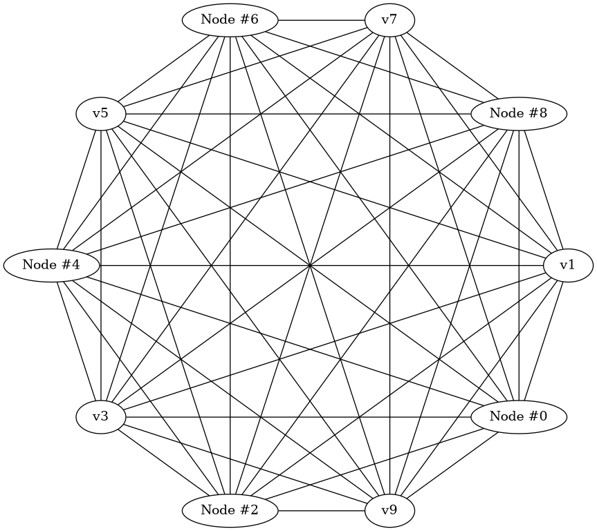

A Simple Usage Example (Complete Graph and Dot Generator)
=========================================================

A Complete Graph of ``n``, is a graph having ``n`` nodes all connected
to each other.

Dot is a graph description language. for more information:
`wikipedia <https://en.wikipedia.org/wiki/DOT_(graph_description_language)>`__,
`graphviz docs <https://graphviz.org/doc/info/lang.html>`__.

in this demonstration, we’re gonna make a very simple dot generator, and
a program that takes ``n`` from user and generates dot source of a
complete graph with ``n`` vertices.

Simple Dot Generator
--------------------

to generate a dot source from a graph, we first make the graph
definition which is just a one liner here, then generate definition of
nodes and their attributes (that we support), then generate edges and
their attributes (in this example, for simplicity, we’re not gonna do
that, but it’s very similar to how we do it for nodes).

let’s make the DotGenerator class!

the code is commented thoroughly and is pretty self-explaining:

.. code:: cpp

   #include <iostream>
   #include <sstream>
   #include <string>
   #include <vector>

   #include <gvizard/gvizgraph.hpp>
   #include <gvizard/attrs/label_related.hpp>

   // dot language requires an identifier name for each node,
   // as a renderer/generator we define our own attr...
   // to use this renderer, the graph's registry must support this type.
   // the default registry (EnTTRegistry) accepts and holds any type.
   struct NodeName { std::string str; };

   // a renderer/generator is a bit complex, making a class is always
   // a wise choice.
   //
   // in this example, we're gonna only support gvizard's Label attribute.
   // adding support of other attributes (depending on their AttributeType)
   // isn't that hard in this class.
   class DotGenerator final {
     // just to make the output rather readable...
     constexpr static const char *str_indent = "    "; // 4 spaces

    public:
     // holding things is no use in this demonstration example...
     // so let's leave it empty.
     DotGenerator() {}

     // we get a GvizGraph with any underlying Graph conforming type in,
     // and generate a dot source string.
     template <typename GraphT>
     std::string generate(const gviz::GvizGraph<GraphT>& graph) const
     {
       std::stringstream strstream{};

       // first line: "graph|digraph {", no id or strict for simplicity reasons...
       strstream << (graph.is_undirected() ? "graph" : "digraph") << " {\n";

       // write definition of each node which is its name and its attributes.
       // (in this case only Label if it's set)
       for (auto node_id : graph.graph.nodes_view()) {
         auto node_name =
             graph.graph.template get_entity_attr<NodeName>(node_id);
         if (!node_name) continue; // without node's name we can't define it

         strstream << str_indent;
         strstream << node_name->str;

         // having an attribute is always optional and graph doesn't enforce
         // such semantics.
         //
         // if it is set, then add desired string at the end of node definition.
         auto opt_label = graph.get_node_label(node_id);
         if (opt_label)
           strstream << " [" << node_attr_to_string(*opt_label) << "]";

         strstream << ";\n";
       }

       // now let's write the edges...
       // notice that we're not supporting edge attributes here.
       // (just for simplicity)
       for (auto edge_id : graph.graph.edges_view()) {
         auto [node_a_id, node_b_id] = *graph.graph.get_edge_nodes(edge_id);

         // both nodes must have name to define them in dot language.
         auto node_a_name =
             graph.graph.template get_entity_attr<NodeName>(node_a_id);
         if (!node_a_name) continue;

         auto node_b_name =
             graph.graph.template get_entity_attr<NodeName>(node_b_id);
         if (!node_b_name) continue;

         // result format: "   {node_a_name} {-- or ->} {node_b_name}\n"
         strstream << str_indent << node_a_name->str << ' '
                   << (graph.is_undirected() ? "--" : "->")
                   << ' ' << node_b_name->str << ";\n";
       }

       strstream << "}"; // close the graph definition...

       return strstream.str(); // our dot source is ready... :)
     }

    private:
     // an attribute is defined as "{attr_name}={attr_value}" ...
     // using function overloading can
     std::string node_attr_to_string(const gviz::attrs::Label& attr) const
     {
       // label's underlying type is EscString which gets node name, edge name, etc..
       // and applies to the given format.
       // here we're not gonna do that due complexity of it.
       return
         std::string(attr.get_name())
         + "="
         + "\"" + attr.get_value().get_format() + "\"";
     }
   };

Writing Complete-Graph generator using our Dot Generator
--------------------------------------------------------

we’re going to make an undirected graph (GvizGraph is undirected by
default), then make ``n`` nodes (``n`` given by user) and store their
IDs in a vector, then iterating over vector and connect each node
together.

then we’ll have a complete graph!

.. code:: cpp

   auto create_complete_graph(std::size_t n) {
     using Graph = gviz::GvizGraph<>;

     Graph g{};

     // to make edges, we need to first have all nodes... so we must store them.
     std::vector<Graph::NodeId> nodes{};
     nodes.reserve(n); // allocate once rather than on each push_back.

     // create vertices and store them to later connect them together.
     for (std::size_t i = 0; i < n; ++i) {
       auto node_id = g.graph.create_node();
       // this line is required by DotGenerator. names a vertex as "v{i}".
       g.graph.set_entity_attr<NodeName>(node_id,
                                         std::string("v") + std::to_string(i));

       // label each even numbered node to "Node #{i}".
       // only labeling is just to show that it's optional
       // and doesn't have to be set.
       if (i % 2 == 0)
         g.set_node_label(node_id, std::string("Node #") + std::to_string(i));

       nodes.push_back(node_id);
     }

     // connect each vertex to all other vertices in the list.
     for (std::size_t i = 0; i < n; ++i) {

       // on undirected graph, i->j and j->i are the same and i==j is invalid.
       // so we skip them.
       for (std::size_t j = 0; j < i; ++j)
         // create the edge...
         g.graph.create_edge(nodes[i], nodes[j]);
     }

     return g;
   }

Generate the dot source of our graph by our DotGenerator
--------------------------------------------------------

simply just get a number from user by argv, call our
``create_complete_graph`` to make the graph, make a ``DotGenerator``
instance and pass the graph to its ``generator`` method, and finally
print the result:

.. code:: cpp

   int main(int argc, char* argv[])
   {
     if (argc != 2) {
       std::cout << "Usage:\n\t" << argv[0] << " <vertex-count>\n";
       return 1;
     }

     std::size_t n = std::stoi(argv[1]);
     if (n > 10000) { // a simple threshold to avoid swallowing memory.
       std::cout << " [Error] maximum nodes to make is: 10000, "
                 << "your input is: " << n << std::endl;
       return 1;
     }

     auto graph = create_complete_graph(n);

     std::cout << DotGenerator().generate(graph) << std::endl;

     return 0;
   }

compiling this example and running it by 6 and 3 for example will give
us:

::

   $ ./complete_graph 6

   graph {
       v0 [label="Node #0"];
       v1;
       v2 [label="Node #2"];
       v3;
       v4 [label="Node #4"];
       v5;
       v1 -- v0;
       v2 -- v0;
       v2 -- v1;
       v3 -- v0;
       v3 -- v1;
       v3 -- v2;
       v4 -- v0;
       v4 -- v1;
       v4 -- v2;
       v4 -- v3;
       v5 -- v0;
       v5 -- v1;
       v5 -- v2;
       v5 -- v3;
       v5 -- v4;
   }

   $ ./complete_graph 3

   graph {
       v0 [label="Node #0"];
       v1;
       v2 [label="Node #2"];
       v1 -- v0;
       v2 -- v0;
       v2 -- v1;
   }

Let’s turn the output dot code into a png, so we can see how it really looks
----------------------------------------------------------------------------

currently there aren’t any renderer made for this library, so we use our
dot generated code and render via ``circo`` engine of ``graphviz``:

(you must have graphviz installed in your operating system)

::

   $ ./complete_graph 10 | circo -Tpng -o test.png

and it’ll draw this: |Complete Graph of 10 Vertices|

